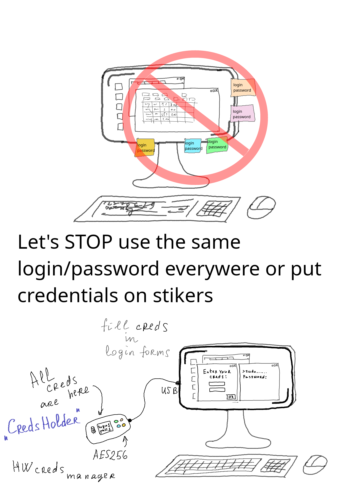

# CredsHolder

Hardware credentials manager.

Secure replacement of stickers on monitor (and other similar stuff) with login and passwords.

CredsHolder makes it easier to use good complex and unique passwords for your accounts on different web sites and other applications. 

# See Also

* [CredsHolder Project Requirements Doc](./proposals/creds-holder.md)

# Project News

## 07 Aug 2026

* Close PasswordWand (clone of PasswordPump with modified code) project as deprecated
* Project has been renamed and started from scratch
  * Reason 1: license has been changed to MIT. I hope that will help for distribution.
  * Reason 2: device SW and HW redesign is needed. Original PasswordPump code base is very complex to be maintainable and extendable.
  * Reason 3: to be not a fork repo of PasswordPump will allow to configure Git LFS and store docs pictures originals in Git.
  * Reason 4: do at least OpenSource project design and development accordign all best practices and without rush.

## 12 Aug 2026

* Finished [CredsHolder Project Requirements Doc](./proposals/creds-holder.md)
* Low Level Design for Authentication is started

## This project was fork of ...

... https://github.com/seawarrior181/PasswordPump

I'd like to thank Dan Murphy for PasswordPump. It's cool idea and device.
I'm appreciate how many features has been implemented in orignal sketch.
