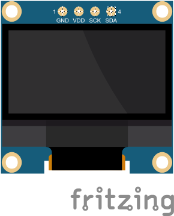
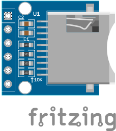
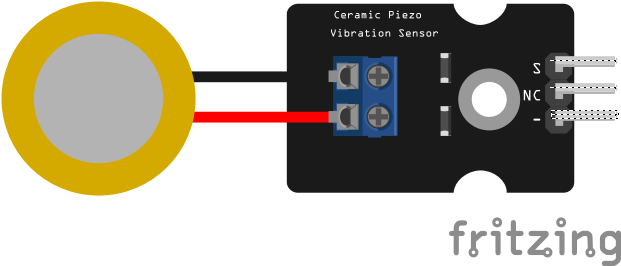
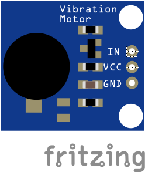

# Fritzing

## Self-done Parts

### Tenstar Robot NRF52840 Pro Micro

That microcontroller board Fritzing part was not founded in Internet and I had to do that myself.

Import next one into your Fritzing to be able use NRF52840 Pro Micro board in schemas: [NRF52840 Pro Micro](./parts/nrf52840_pro_micro/NRF52840 Pro Micro.fzpz)

Some notes:
* All needed parts Breadboard, Schematic, PCB, Connectors and Metadata has been added following [Fritzings Graphic Standards](https://fritzing.org/fritzings-graphic-standards) but ...
* .. I've tried to make board contacts as similar as possible to real board but I had no PDF/PostScript/SVG breadboard schema from manufacturer and there is absolutely no guarantee that exporting PCB will give expected results.
* So that fritzing part is good enough for making schemas in Fritzing and that's enough for nearest goals

#### Links

* https://www.beachyuk.com/blog/connecting-and-testing-promicro-nrf52840-clones
* https://github.com/ICantMakeThings/Nicenano-NRF52-Supermini-PlatformIO-Support#1
* https://doxygen.riot-os.org/group__boards__pro-micro-nrf52840.html
* https://tenstar.pro/nrf52840-pinout/
* https://chat.nologo.tech/d/80
* https://tinygo.org/docs/reference/microcontrollers/boards/nicenano/
* https://nrfconnectdocs.nordicsemi.com/ncs/3.2.4/zephyr/boards/others/promicro_nrf52840/doc/index.html

## Downloaded Parts

| | URL |
| :---: | :---: |
|  | [Link](https://github.com/AlexGyver/GyverKIT/blob/master/Fritzing%20parts/OLED%20128x64%20I2C.fzpz) |
|  | [Link](https://digitalconcepts.net.au/fritzing/content/support/parts/microSD%20Card%20Reader.fzpz) |
|  | [Link](https://forum.fritzing.org/t/piezoelectric-ceramic-vibration-sensors/33600) |
|  | [Link](https://forum.fritzing.org/t/looking-for-a-vibration-module/26877) |

#### Links

* https://digitalconcepts.net.au/fritzing/index.php?op=parts
