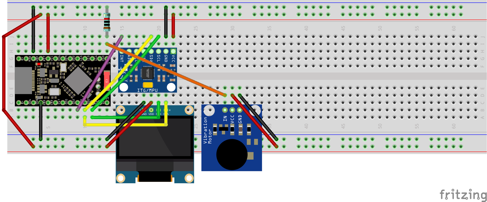

# POC No 4 UI (OLED, MPU6050, vibration motor)

## Goal

Help user to sense needed tilt angle.

## Proposals

Make very short vibration on tilting device up to threshold angle but before return device back to horizontal position.

## Results

Touching senses are cool. I'm feeling more navigation control.
