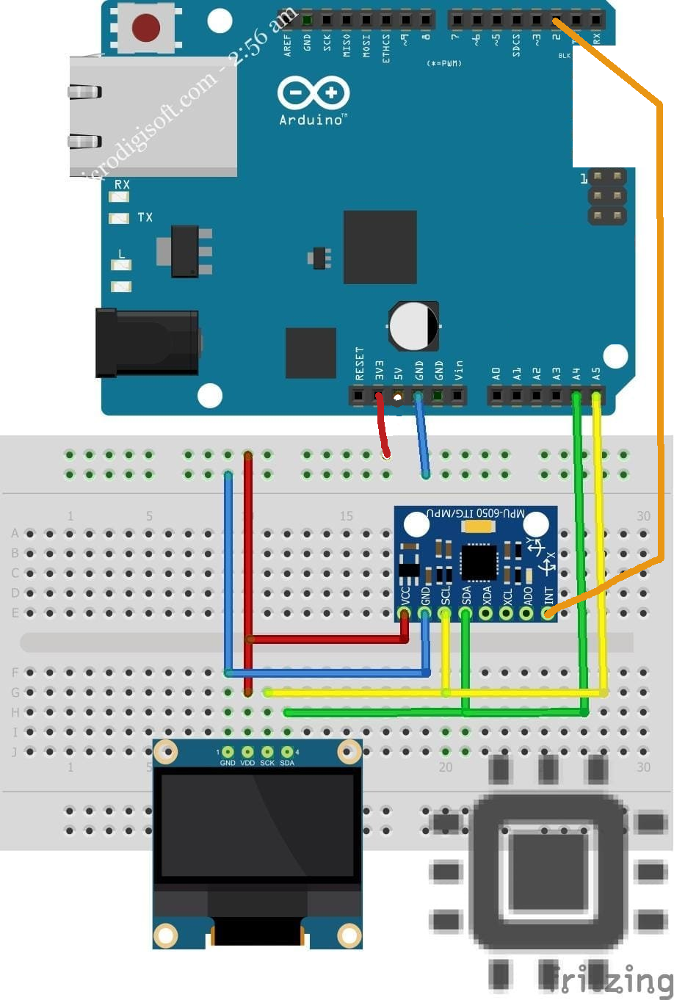

## Summary

POC proved that it's possible to detect device tilts (on left, on right, forward, backward) using MPU6050 and Arduino Uno as a controller:

Sources are located in `./CredsHolderPOC/`

GY-521 with MPU6050 has been used because can work with 3.3V as NRF52840 and with 5V as Arduino.

MPU6050 DMP has been used because of measurement accuracy and ability to do that not on MCU and decrease requirements for it.

DMP also has motion detection capability so in future it'll be possible to improve power consumption and enable MCU sleep mode until device will be taken by User hands.

## Abbreviations and Terms

* POC - Proof Of Concept
* DMP - Digital Motion Processor

## Notes

Initial MPU-6050 calibration can be done via sketch: https://github.com/jrowberg/i2cdevlib/blob/master/Arduino/MPU6050/examples/IMU_Zero/IMU_Zero.ino

If use [MPU-6050 with DMP](https://github.com/jrowberg/i2cdevlib/blob/master/Arduino/MPU6050/examples/MPU6050_DMP6/MPU6050_DMP6.ino) then

* we a able to receive yaw, pitch and roll with good sensitive
* but in less then a minute sketch stuck due to FIFO overflow

Next steps to try:
* Try sketch MPU6050_6Axis_MotionApps612.cpp with newer DMP firmware version - v6.12
* Try sketch MPU6050_6Axis_MotionApps20.cpp with decrease fifo queue speed
* Handling FIFO overflow cleanly is also a good idea - for future

With DMP firmware v6.12 ( DLPF disabled?) and sample rate decreased to 100 Hz the stuck happen.

With DMP firmware v2.0  (accel +-2000, DLPF 42Hz) and sample rate decreased to 100 Hz there is no stuck.

With DMP firmware v2.0  (accel +-250, DLPF 42Hz) and sample rate decreased to 100 Hz there is no stuck but tilt detection is not possible because after tilt there is a period (~10 sec) of returning back to 0.

With DMP firmware v2.0  (accel +-250, DLPF 42Hz) and sample rate decreased to 200 Hz there is stuck

With DMP firmware v2.0  (accel +-500, DLPF 42Hz, fifo rate 100 Hz) there is stuck but later and value return back to ~0 during 2 sec

With DMP firmware v2.0  (accel +-500, DLPF 42Hz, fifo rate 125 Hz) there is stuck but later and value return back to ~0 during 2 sec

With DMP firmware v2.0  (accel +-1000, DLPF 42Hz, fifo rate 125 Hz) there is stuck but later and value return back to ~0 during 1 sec !!

**With DMP firmware v2.0  (accel sensitivity +-500 degress/sec, DLPF 42Hz, fifo rate 60 Hz) work is enough stable, measurements is about 1 time per second, tilt detection has been done.**

# Links

## Articles

* https://mjwhite8119.github.io/Robots/mpu6050
* https://alexgyver.ru/arduino-mpu6050/
* https://arduinokitproject.com/mpu6050-accel-gyro-arduino-tutorial/
* https://www.chrobotics.com/library

## Libraries

* https://github.com/jrowberg/i2cdevlib
* https://github.com/adafruit/Adafruit_MPU6050
