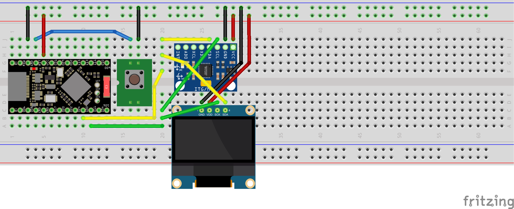

# POC No2. Start use Tenstar Robot NRF52840 Pro Micro

## Goal

Run the same UI POC with MPU6050 + OLED 0.96 inch as POC No1 but using Tenstar Robot NRF52840 Pro Micro.

## Schema



## Changes

POC No1 code did not work as-is and required next main changes:

* Changed numbers of PINs according NRF52840 board
* Up Serial speed up to 115200
* Remove increasing I2C bus speed 

```diff
diff --color -u ./ui-mpu-6050-with-oled-on-arduino-uno/CredsHolderPOC/CredsHolderPOC.ino ./ui-mpu-6050-with-oled-on-nrf52840/CredsHolderPOC/CredsHolderPOC.ino
--- ./ui-mpu-6050-with-oled-on-arduino-uno/CredsHolderPOC/CredsHolderPOC.ino	2026-08-19 16:23:57.760809528 +0500
+++ ./ui-mpu-6050-with-oled-on-nrf52840/CredsHolderPOC/CredsHolderPOC.ino	2026-08-21 21:06:20.894398901 +0500
@@ -41,8 +41,17 @@
 // more info, see: http://en.wikipedia.org/wiki/Gimbal_lock)
 #define OUTPUT_READABLE_YAWPITCHROLL
 
-#define INTERRUPT_PIN 2  // use pin 2 on Arduino Uno & most boards
-#define LED_PIN 13 // (Arduino is 13, Teensy is 11, Teensy++ is 6)
+// Arduino
+// #define INTERRUPT_PIN 2  // use pin 2 on Arduino Uno & most boards
+// #define LED_PIN 13 // (Arduino is 13, Teensy is 11, Teensy++ is 6)
+
+// NRF52840 Pro Micro
+// #define P0_24 (D5)
+#define INTERRUPT_PIN 5
+// In "variant.h" for Super Mini NRF52840:
+// #define PIN_LED              (22) // USR LED is P0.15
+#define LED_PIN 22
+
 bool blinkState = false;
 
 // MPU control/status vars
@@ -110,18 +119,12 @@
 
 void setup() {
   // join I2C bus (I2Cdev library doesn't do this automatically)
-#if I2CDEV_IMPLEMENTATION == I2CDEV_ARDUINO_WIRE
-  Wire.begin();
-  Wire.setClock(400000); // 400kHz I2C clock. Comment this line if having compilation difficulties
-#elif I2CDEV_IMPLEMENTATION == I2CDEV_BUILTIN_FASTWIRE
-  Fastwire::setup(400, true);
-#endif
-
   // initialize serial communication
   // (115200 chosen because it is required for Teapot Demo output, but it's
   // really up to you depending on your project)
-  Serial.begin(38400);
-  // while (!Serial); // wait for Leonardo enumeration, others continue immediately
+  // Serial.begin(38400); // Arduino
+  Serial.begin(115200); // nrf52840 pro micro
+  while (!Serial); // wait for Leonardo enumeration, others continue immediately
 
   // NOTE: 8MHz or slower host processors, like the Teensy @ 3.3V or Arduino
   // Pro Mini running at 3.3V, cannot handle this baud rate reliably due to
@@ -131,6 +134,14 @@
 
   // initialize device
   if (Serial) { Serial.println(F("Initializing I2C devices...")); }
+
+#if I2CDEV_IMPLEMENTATION == I2CDEV_ARDUINO_WIRE
+  Wire.begin();
+  // Wire.setClock(400000); // 400kHz I2C clock. Comment this line if having compilation difficulties
+#elif I2CDEV_IMPLEMENTATION == I2CDEV_BUILTIN_FASTWIRE
+  // Fastwire::setup(400, true);
+#endif
+
   mpu.initialize();
   pinMode(INTERRUPT_PIN, INPUT);
```

After that code start work as in POC No1.

One more thing has been tried - detect case tap/knock but without success, if tap during taking device in arms then we see acceleration increasing in 2 or all 3 axis sometimes.

## Conclusions

* We can continue use NRF52840 Pro Micro board
* MPU6050 as is not suitable To detect tap/knock. Let's try piezoelectric sensor for that in one of next POCs
* Plug board to separate USB port of your PC.
  * it'll be more stable then plug in USB hub port which communicate also you keyboards and trackball

## Notes

Original bootloader:

```
UF2 Bootloader 0.6.0 lib/nrfx (v2.0.0) lib/tinyusb (0.10.1-41-gdf0cda2d) lib/uf2 (remotes/origin/configupdate-9-gadbb8c7)
Model: nice!nano
Board-ID: nRF52840-nicenano
SoftDevice: S140 version 6.1.1
Date: Jun 19 2021
```

"Get board into" sketch from [article](https://www.beachyuk.com/blog/connecting-and-testing-promicro-nrf52840-clones) prints next:
```
23:15:32.168 -> --------------------------------------------------
23:15:32.168 -> ProMicro / SuperMini nRF52840 hardware information
23:15:32.168 -> --------------------------------------------------
23:15:32.168 -> Device ID: EB3536513509A804
23:15:32.168 -> Part: 00052840
23:15:32.168 -> Variant: AAD0
23:15:32.168 -> Package: 00002004 (QIxx - 7x7 73-pin aQFN)
23:15:32.168 -> RAM: 256 KB (262144 bytes)
23:15:32.168 -> Flash: 1024 KB (1.0 MB)
23:15:32.168 -> BLE MAC address: A9:0A:4B:AD:B5:37
23:15:32.168 -> Internal temperature: 24.00°C
23:15:32.168 -> Bootloader version: s140 7.3.0
```

I2C pins are located on non standard pins. Next is founded in `~/.arduino15/packages/nRFMicro-like-Boards/hardware/nrf52/1.0.2/variants/SuperMini_nRF52840/variant.h`:
```
/*
 * Wire Interfaces
 */
#define WIRE_INTERFACES_COUNT 2

#define PIN_WIRE_SDA         (6) // P1.00 - D6
#define PIN_WIRE_SCL         (7) // P0.11 - D7

static const uint8_t SDA = PIN_WIRE_SDA;
static const uint8_t SCL = PIN_WIRE_SCL;

#define PIN_WIRE1_SDA        (13) // P1.13 - D13
#define PIN_WIRE1_SCL        (14) // P1.15 - D14

```

# Links

* How burn using Arduino IDE: https://www.beachyuk.com/blog/connecting-and-testing-promicro-nrf52840-clones
* https://doxygen.riot-os.org/group__boards__pro-micro-nrf52840.html
* https://digitalconcepts.net.au/fritzing/index.php?op=partsu
