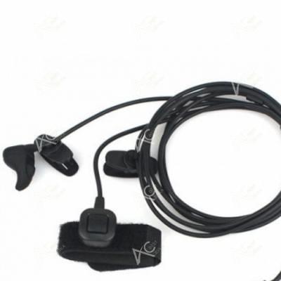

# CredsHolder Authentication

## Introduction

This document is a Low Level Design for CredsHolder feature "Authentication". It's about unlocking CredsHolder, it's NOT about credentials stored inside.

We'll try to find the optimal way to protect CredsHolder from non-authorized access.

It's important part of CredsHolder because main differences of other Hardware Credential Manager projects in authentication method.

We figure out how User will we authenticated, what input/output devices (buttons, displays, etc.) will be needed for that.

Assume that R-10 "Navigation" is out of this design scope.

## Abbreviations and Terms

* HW - hardware
* Hardware Credential Manager - separate device which store credentials
* HLD - High Level Design (see [CONTRIBUTING.md](/CONTRIBUTING.md) for details)
* LLD - Low Level Design (see [CONTRIBUTING.md](/CONTRIBUTING.md) for details)
* OTP - One Time Password
* KEK - Key Encryption Key - key encrypted MEK
* MEK - Media Encryption Key - key encrypted application data (credential accounts)
* SOC - System On Chip
* Controller - Device central control module - Arduino, NRF52840, STM32, etc.
* NFC - Near Field Communication - communication technology for distances less 10 cm
* PIN - Personal Identification Number

## HLD Requirements

RE: [CredsHolder Project Requirements Doc](./creds-holder.md)

| No | User Story |
| --- | --- |
| S-18 | As a User I'd like to change authentication key (master password, etc.) if it was vulnerable. |

| No | Re User Story | Requirement |
| --- | --- | --- |
| R-24 | S-10 | CredsHolder MUST authenticate User before grand access to application data. |
| R-25 | S-10 | If User assumes that CredsHolder cannot be stolen then it should be able to turn authentication off. So ownership of CredsHolder will mean passed authentication. |
| R-20 | S-7 | Option 1. CredsHolder SHOULD support easy installing additional components with shields. <br/> :-1: increased complexity<br/>:-1: bigger case size <br/>Option 2. Needed components SHOULD be part of MVP model.<br/>:-1: increased prise<br/>:+1: incremental development of usable CredsHolder version<br/>:+1: chance to add additional functions to device, e.g. alarm clock)<br/>Option 3. CredsHolder is always DYI device. <br/>:-1: contradiction with S-16 <br/>So if we decided to develop turning on a blue/green LED after pass authentication in release after MVP, then MVP hardware schema MUST contain LED which will not work in MVP version. |
| S-19 (optional) | As a Corporate Employee I'd like to be able remotely unlock CredsHolder, e.g. one employee say password by phone to another employee. |
| R-41 (optional) | S-19 (optional) | CredsHolder MUST allow password authentication. Maybe like alternative method. |

## Proposals

* User unblocks CredsHolder with PIN
* CredsHolder has no buttons or rotary encoder. All manipulations via movements of Device: forward lean, backward lean, shake horizontally, etc.
* PIN will be entered with randomization: 
  * sequence of entering PIN position is random
  * sequence of scrolling digits to choose for position is random too.
* CredsHolder does not show PIN on display but ask what position and what digit to enter using Morse code via vibrations
* Auto-logout:
  * User may log out explicitly.
  * Auto-logout after some period without User activity. It's a backup for case when User forgot to lock CredsHolder.
  * Logout if User turn CredsHolder upside down
  * Logout if User dropped the device

## Proposals designing chain

At first, let's list variants how User can prove that he is CredsHolder owner:

| Authentication Method | User use... | CredsHolder UI | Comment |
| :---: | :---: | :---: | :---: |
| No Password, No Authentication | CredsHolder Ownership | No addition for Auth | Only for restricted area usage or in special cases |
| Password | wired/wireless full format keyboard<br/> | USB-B port to connect keyboard cable or radio adapter<br/>Display to show password | :+1: easy to type any text<br/> :+1: arrow buttons are present<br/>:-1: it's not mobile device, keyboard is needed |
| Password | wired/wireless mini keyboard<br/> | USB-B port to connect keyboard cable or radio adapter<br/>Display to show password | :+1: possible to type any text<br/>:+1: arrow buttons are present<br/>:-1: difficult to work by one hand |
| Password | - | Rotary-Encoder(or Wheel) + Buttons<br/><br/>:heavy_plus_sign:<br/> | :+1: possible to type a word<br/>:+1: no additional equipment<br/>:+1: theoretically it's possible to do that by one hand<br/>:-1: non minimalistic device size |
| Some amount of words from [SLIP39 wordlist](https://github.com/satoshilabs/slips/blob/master/slip-0039/wordlist.txt) | Rotary-Encoder(or Wheel) + Buttons<br/><br/>:heavy_plus_sign:<br/> | Each word will define an index in wordlist, other words - a number [0 - 1023]. Such several indexes will give more long number then just PIN.<br/>:+1: can be used across all devices because SLIP39 is open standard<br/>:heavy_minus_sign: it'll be difficult to navigate between 1024 wordlist to choose needed...  |
| PIN | - | PIN board<br/> | :+1: easy to type digits<br/>:-1: can type only digits<br/>:-1: size is not minimalistic |
| Password, PIN | - | Touch LCD 3.2 inch<br/> | :+1: UI freedom - any buttons, text, etc.<br/>:-1: in 2-3 times more expensive then encoder + buttons |
| Password, PIN | - | Touch LCD 2.4 inch (71x52mm)<br/> | :+1: UI freedom - any buttons, text, etc.<br/>:+1: price is similar as buttons + encoder<br/>:+1: enough small size<br/>? how hide from foreign eyes?<br/>:-1: development complexity increase significantly<br/>more simple components schema |
| PIN | - | Rotary-Encoder(or Wheel) + Buttons<br/><br/>:heavy_plus_sign:<br/> | <br/>:+1: no additional equipment<br/>:+1: theoretically it's possible to do that by one hand<br/>:-1: non minimalistic device size |
| PIN via typing Morse code | Pushing one button typing using Morse code | Button<br/> | :+1: less buttons will be needed<br/> :-1: only digits are available<br/>:-1: modern User does not know Morse code |
| Password via typing Morse code | Pushing one button typing using Morse code | Button<br/> | :+1: less buttons will be needed<br/> :-1: only digits and alpha are available<br/>:-1: modern User does not know Morse code |
| ISO14443 Card | Card | NFC reader<br/> | :-1: may be stolen together with CredsHolder. Can be used as 2FA. |
| OTP | Separate OTP device/application | PIN board<br/> | :+1: only digits are needed<br/>:-1: how generate KEK if passwords is one time use?<br/>:-1: separate device/app is needed |
| Biometric. Voice | Voice | Microphone<br/> | :-1: Need voice recognition AI and consequent requirements for Controller |
| Biometric. Fingerprint | Finger | Fingerprint scanner<br/> | :-1: difficult to say how difficult to trick cheap scanner<br/>:-1: high price |
| Biometric. Eye | Eye | Eye scanner | :-1: if eye is compromise then only 2nd one is available |
| Biometric. Palm vein pattern | Arm | Palm vein scanner | :-1: expensive<br/>:-1: size |
| Biometric. Mind (Sci-Fi) | Human Brain 

### What User should remember or have?

So if shortly we may use next to prove ownership: Password, PIN, Biometric, 2FA or their combinations.
* Password
* PIN
* Biometric
* 2FA (RFC card)
* SLIP39 words

#### Password

Password is used in projects:
* [Pastilda Sources](https://github.com/thirdpin/pastilda)
* RecZone Password Safe

:heavy_plus_sign: Give better protection for bruteforce attacks if use non-digit symbols too.

#### PIN

PIN is used in:
* [Trezor Wallet](https://trezor.io/)
* [Mooltipass](https://www.themooltipass.com/)
* [PasswordPump](https://github.com/seawarrior181/PasswordPump)
* [PasswordPumpII](https://www.5volts.org/post/passwordpump-v2-0)
* [Istorage DatAshur](http://www.byte-on.ru/catalog/Istorage-DatAshur/fleshka_istorage_datashur_pro_16gb/)
* Chipdrive MyKey

From [Trezor Wallet site](https://trezor.io/learn/basics/what-is-a-hardware-wallet):
```
Security and PIN protection
A key security feature is PIN protection, which allows you to secure your Trezor with a PIN up to 50 digits long. This provides quick access to your private keys as long as you have the device. If the device is lost, unauthorized access is incredibly unlikely—after each incorrect PIN attempt, the waiting time doubles, and after 16 failed attempts, the device is wiped automatically.
```

From [Trezor Firmware GitHub](https://github.com/trezor/trezor-firmware/tree/main/storage#pin):
```
The PIN is not stored in the flash storage. An entry is added to the flash storage consisting of a 256-bit encrypted data encryption key (EDEK) followed by a 128-bit encrypted storage authentication key (ESAK) and a 64-bit PIN verification code (PVC). The PIN is used to decrypt the EDEK and ESAK and the PVC is used to verify that the correct PIN was used. The resulting data encryption key (DEK) is then used to encrypt/decrypt protected entries in the flash storage. We use Chacha20Poly1305 as defined in RFC 7539 to encrypt the EDEK and the protected entries. The storage authentication key (SAK) is used to authenticate the list of (APP, KEY) values for all protected entries that have been set in the storage. This prevents an attacker from erasing or adding entries to the storage.

PIN verification and decryption of protected entries in flash storage

1. From the flash storage read the entry containing the random salt, EDEK and PVC.

2. Gather constant data from various system resources such as the ProcessorID (aka Unique device ID) and any hardware serial numbers that are available. The concatenation of this data with the random salt will be referred to as salt.

3. Prompt the user to enter the PIN and compute:

PBKDF2(PRF = HMAC-SHA256, Password = pin, Salt = salt, iterations = 10000, dkLen = 352 bits)

The first 256 bits of the output will be used as the key encryption key (KEK) and the remaining 96 bits will be used as the key encryption initialization vector (KEIV).

Note: Since two blocks of output need to be produced in PBKDF2 the total number of iterations is 20000.

...

```
From [Mooltipass Firmware GitHub](https://github.com/mooltipass/minible#the-mooltipass-devices):

```
All Mooltipass devices (Mooltipass Standard, Mooltipass Mini, Mooltipass Mini BLE) are based on the same principle: each device contains one (or more) user database(s) AES-256 encrypted with a key stored on a PIN-locked smartcard. 
```

#### Biometric

:heavy_minus_sign: more expensive components
:heavy_minus_sign: dependency on devices internal non OpenSource implementation
:heavy_minus_sign: using biometric increases chance that Intruder will cut part of User's body to unlock CredsHolder (((

#### 2FA (RFC card)

:heavy_minus_sign: Maybe stolen together with CredsHolder

Maybe it's possible variant for Corporate where ISO14443 cards is widely used by employees for identification.

#### SLIP39 words

Each word from [SLIP39 wordlist](https://github.com/satoshilabs/slips/blob/master/slip-0039/wordlist.txt) means an index in that wordlist, so it's a number at diapason [0 - 1023].

Such several numbers will give more long number then PIN.

:+1: can be used on new device if original is broken because SLIP39 is open standard

:heavy_minus_sign: I'm afraid that navigation among 1024 words will be equal to Password typing

This idea may be postponed upon good idea for navigation.

### Proposal 1. Let's use PIN

According to information above the PIN is widely used in similar projects, and in smartphones and so on.

| Proposal 1 |
| --- |
| Let's assume that PIN is enough good for authenticate User. |
| It must be not possible to decrypt application data on extractable CredsHolder storage knowing PIN only.<br/>Otherwise bruteforce will help Intruder.<br/>It means that "salt" MUST depend on concrete Controller identity - ProcessID, ... | 

Minimal PIN length will be known after finish [CredsHolder Storage Design](./creds-holder-storage.md)

## What about Intruder threat?

We must take into account not only usability of CredsHolder interface but also outside conditions - Intruders spying on User. Therefore we may assume that all sequence of manipulations, pushes, clicks made by User during authentication is known by Intruder, e.g. he used video camera to record whole process.

We need to make "sequence of typed digits" less usable.

Proposals: 

* User types PIN not in sequential way - 1st digit, 2nd one, 3rd one, etc. - but in random sequence, e.g. 8th digit, 3rd one, 1st one, 6th one, etc. CredsHolder will require User to do that (see screens below) |
* Not allow to record display with password or not use display at all |

| :warning: |
|---|
| Good random generator is needed ! |

Example of Authentication procedure screens:
```
+-----------------+
| Enter PIN:      |
|                 |
| ..2...         |
+-----------------+
       ||
       \/
+-----------------+
| Enter PIN:      |
|                 |
| 1.*...          |
+-----------------+
       ||
       \/
+-----------------+
| Enter PIN:      |
|                 |
| *.*.5.          |
+-----------------+
       ||
       \/
+-----------------+
| Enter PIN:      |
|                 |
| *4*.*.          |
+-----------------+
       ||
       \/
+-----------------+
| Enter PIN:      |
|                 |
| ***9*.          |
+-----------------+
       ||
       \/
+-----------------+
| Enter PIN:      |
|                 |
| *****7          |
+-----------------+
```

### Proposal 2. Non recognizable PIN

TRIZ Ideal Final Result:
* During authentication procedure User is typing PIN but used digits are not recognizable by visual observation

#### PIN keyboard


Buttons has titles - 0, 1, 2, .., <br/>BUT they must mean another digits, changing randomly for each PIN position:<br/>for example,<br/> 0245791386 for 1st one,<br/> 8194275360 - for 2nd one and etc.

Option 1. Will work for virtual keyboard on touch LCD screen. There we may print any digits on buttons.

Option 2. Yes, buttons will mean random digit, User will push them all one by one finding needed and push separate button to confirm entering digit.

#### Rotate Encoder + Buttons

:heavy_plus_sign:

CredsHolder suggests digits to type into PIN position not in regular sequence 0, 1, 2, .., 9 but randomly, e.g. 3, 5, 4, ...<br/>BUT user should see on display suggested digits.

If display will be protected Intruder will cannot even recognize digits from video record of authentication.

#### Voice recognition using wireless laryngophone with bone conduction



Laryngophone with bone conduction has one big advantage - voice is listen by CredsHolder but not by outside people or spy equipment.

User can make voice command to device in all scenarios, not only during authentication.

:heavy_minus_sign: expensive
:heavy_minus_sign: higher requirements for Controller

#### Position sensor

Required to install: position sensor and vibration motor

User will lean CredsHolder forward to scroll digit up and lean CredsHolder down to scroll digit down.

CredsHolder will vibrate on recognition movement with device made by User.

CredsHolder suggests digits to type into PIN position not in regular sequence 0, 1, 2, .., 9 but randomly, e.g. 3, 5, 4, ...<br/>BUT user should see on display suggested digits.

:heavy_minus_sign: BUT display is needed.

If display will be protected Intruder will cannot even recognize digits from video record of authentication.

:heavy_minus_sign: :heavy_plus_sign: Unknown influence on defencing screen from outside watch during active moving CredsHolder... 

#### Conclusion

Suggestions are good. Let's wait design for navigation to choose someone.

Let's calculate a chance to guess PIN if Intruder knows used digits but not their sequence:
* Intruder knows the used symbols because recorded typing process
* Intruder does not know sequence of that symbols
* So there are N! possible combinations ...
* ... and only 10 fail tries before CredsHolder full-block/erasing/etc.
* Therefore chance is 10/(N!), e.g. for N=6: `10/(N!) = 10/(1*2*3*4*5*6) = 0.01389 = 1.389%`

### Proposal 3. Invisible display

TRIZ Ideal Final Result: 
* CredsHolder/display during authentication procedure will not allow Intruder to recognize PIN typing by User.
* CredsHolder does not use display during authentication but User can type PIN.

#### Entities

* Case
* Display
* Buttons
* Controller
* Possible additional components - vibration module, LEDs, microphone, audio output, etc.
* User (arms, senses)
* Air outside CredsHolder
* Lightness outside CredsHolder
* Position of CredsHolder in space

It's reasonable to do some trick only during authentication and after unlocking usage will be as usual.

Possible variants:

#### PIN via listen Morse code

Used inputs:

:heavy_plus_sign:

Display will not show password typing or print how many digits has been entered.

* CredsHolder has vibration module
* CredsHolder vibrates position of PIN digit using Morse code
* then CredsHolder vibrates

| Digit | Morse code |
| --- | --- |
| 1 | :black_circle: :heavy_minus_sign: :heavy_minus_sign: :heavy_minus_sign: :heavy_minus_sign: |
| 2 | :black_circle: :black_circle: :heavy_minus_sign: :heavy_minus_sign: :heavy_minus_sign: |
| 3 | :black_circle: :black_circle: :black_circle: :heavy_minus_sign: :heavy_minus_sign: |
| 4 | :black_circle: :black_circle: :black_circle: :black_circle: :heavy_minus_sign: |
| 5 | :black_circle: :black_circle: :black_circle: :black_circle: :black_circle: |
| 6 | :heavy_minus_sign: :black_circle: :black_circle: :black_circle: :black_circle: |
| 7 | :heavy_minus_sign: :heavy_minus_sign: :black_circle: :black_circle: :black_circle: |
| 8 | :heavy_minus_sign: :heavy_minus_sign: :heavy_minus_sign: :black_circle: :black_circle: |
| 9 | :heavy_minus_sign: :heavy_minus_sign: :heavy_minus_sign: :heavy_minus_sign: :black_circle: |
| 0 | :heavy_minus_sign: :heavy_minus_sign: :heavy_minus_sign: :heavy_minus_sign: :heavy_minus_sign: |

#### CredsHolder speak digits via wired or wireless headset

If CredsHolder has audio out then can pronounce digits to User via headset.

:heavy_minus_sign: Difficult to use when high noise everywhere, e.g. in server room.

#### Display with Braille cipher

Separate display which may show digits as a dots in Braille cipher. User should touch it by fingers and recognize suggested digit.

:heavy_minus_sign: very specific, low usability
:heavy_minus_sign: expensive

#### OLED is hidden in case and covered by anti spy glass


### Proposal 4. Delay between fail tries

* CredsHolder remember amount of fail tries on plugging out from User device
* CredsHolder is fully locked between fail tries for in 2 times more period then previously
* CredsHolder will erase data after N fail tries (must be set in configuration)
* CredsHolder do not allow enter the same false PIN twice to avoid lost try

| Reason |
|---|
| If you'll be able find/return CredsHolder then you'll be able to try unlock in very long period during which it'll be unusable for you.<br/>Make backup regular. |

### Proposal 5. Log out

TRIZ Ideal Final Result: 
* CredsHolder lock itself when become unneeded for User

Proposals:
* User may log out explicitly.
* Auto-logout after some period without User activity. It's a backup for case when User forgot to lock CredsHolder.
* Logout if User turn CredsHolder upside down
* Logout if User dropped the device


