# CredsHolder Authentication

## Introduction

This document is a Low Level Design for CredsHolder feature "Authentication".

We'll try to find the optimal way to protect CredsHolder from non authorized access.

It's one of most important themes of current project because User must be sure that it's safe to use CredsHolder.

Let's figure out how will we authenticate User and what input/output devices (buttons, displays, etc.) are needed for that.

## Abbreviations and Terms

* Hardware Credential Manager - separate device which store credentials
* HLD - High Level Design (see [CONTRIBUTING.md](./CONTRIBUTING.md) for details)
* LLD - Low Level Design (see [CONTRIBUTING.md](./CONTRIBUTING.md) for details)
* OTP - One Time Password
* KEK - Key Encryption Key - key encrypted MEK
* MEK - Media Encryption Key - key encrypted application data (credential accounts)
* SOC - System On Chip
* Controller - Device central control module - Arduino, NRF52840, STM32, etc.

## HLD Requirements

RE: [CredsHolder Project Requirements Doc](./creds-holder.md)

| No | User Story |
| --- | --- |
| S-18 | As a User I'd like to change authentication key (master password, etc.) if it was vulnerable. |

| No | Re User Story | Requirement |
| --- | --- | --- |
| R-24 | S-10 | CredsHolder MUST authenticate User before grand access to application data. |
| R-25 | S-10 | If User assumes that CredsHolder cannot be stolen then it should be able to turn authentication off. So ownership of CredsHolder will mean passed authentication. |
| R-41 (optional) | S-19 (optional) | CredsHolder MUST allow password authentication. Maybe like alternative method. |
| R-20 | S-7 | Option 1. CredsHolder SHOULD support easy installing additional components with shields. <br/> :-1: increased complexity<br/>:-1: bigger case size <br/>Option 2. Needed components SHOULD be part of MVP model.<br/>:-1: increased prise<br/>:+1: incremental development of usable CredsHolder version<br/>:+1: chance to add additional functions to device, e.g. alarm clock)<br/>Option 3. CredsHolder is always DYI device. <br/>:-1: contradiction with S-16 <br/>So if we decided to develop turning on a blue/green LED after pass authentication in release after MVP, then MVP hardware schema MUST contain LED which will not work in MVP version. |

## Proposals

At first, let's list variants how User can prove that he is CredsHolder owner and choose the most perspective.

| Auth Method | User use... | CredsHolder UI | Comment |
| :---: | :---: | :---: | :---: |
| No Password, No Authentication | CredsHolder Ownership | No addition for Auth | Only for restricted area usage or in special cases |
| Password | wired/wireless full format keyboard<br/>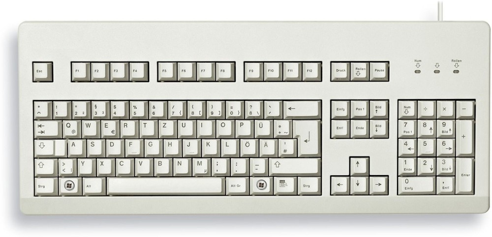 | USB-B port to connect keyboard cable or radio adapter<br/>Display to show password | :+1: easy to type any text<br/> :+1: arrow buttons are present<br/>:-1: it's not mobile device, keyboard is needed |
| Password | wired/wireless mini keyboard<br/>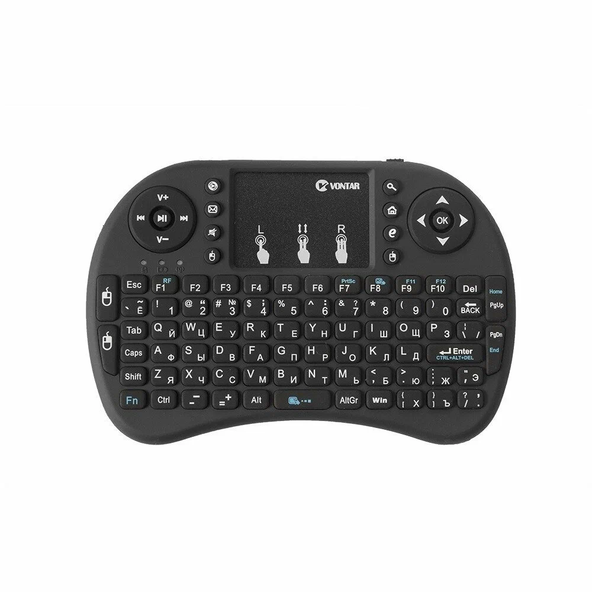 | USB-B port to connect keyboard cable or radio adapter<br/>Display to show password | :+1: possible to type any text<br/>:+1: arrow buttons are present<br/>:-1: difficult to work by one hand |
| Password | Fingers | Rotary-Encoder(or Wheel) + Buttons<br/>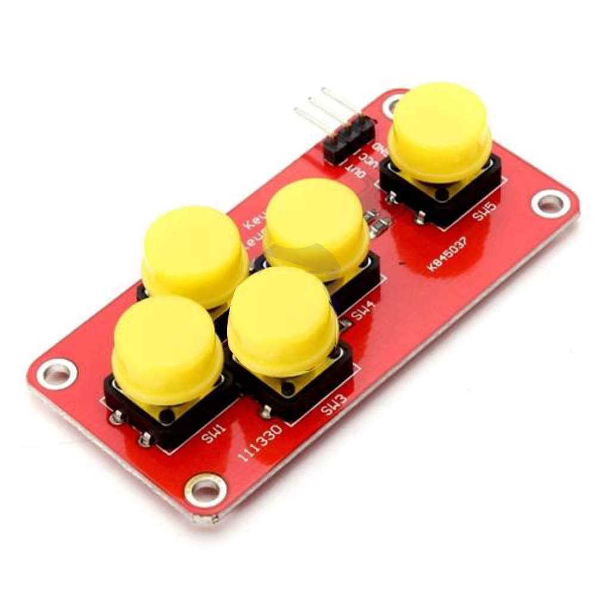<br/>:heavy_plus_sign:<br/>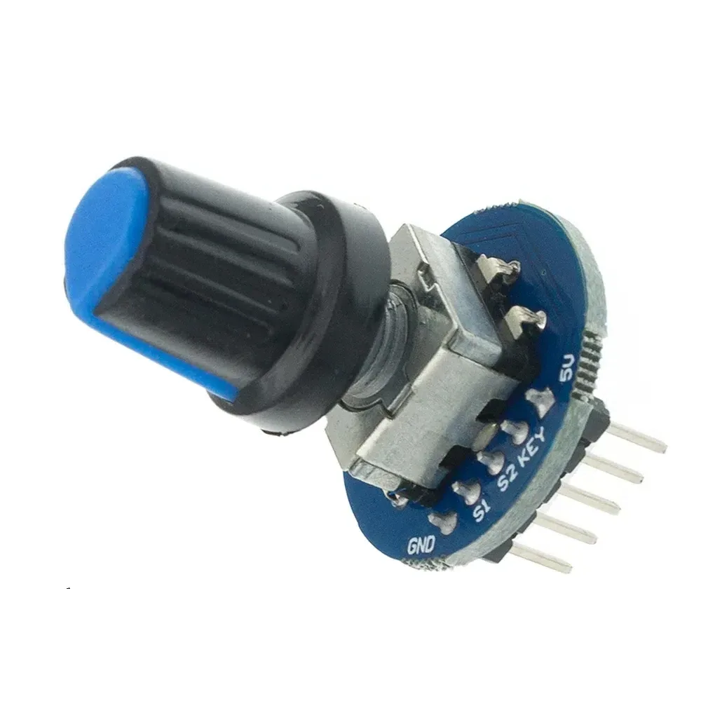 | :+1: possible to type a word<br/>:+1: no additional equipment<br/>:+1: theoretically it's possible to do that by one hand<br/>:-1: non minimalistic device size |
| PIN | Fingers | PIN board<br/>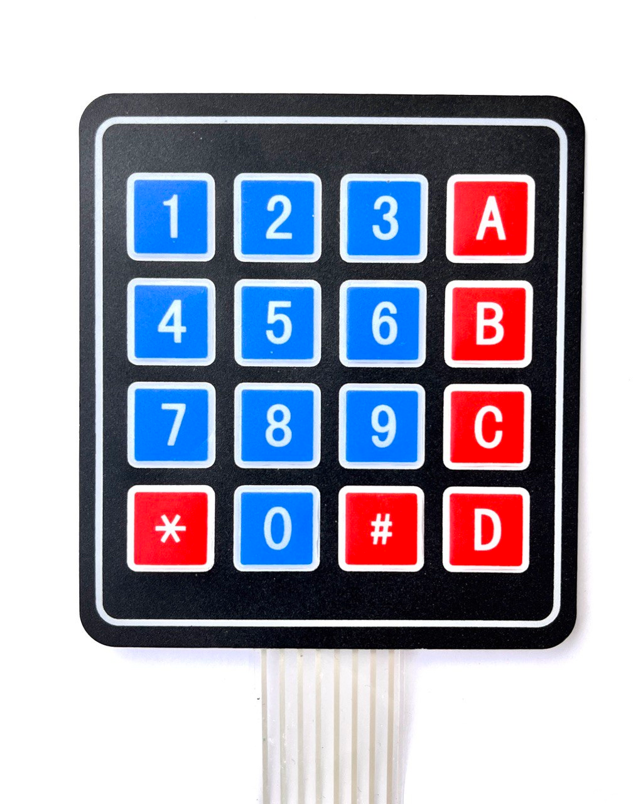 | :+1: easy to type digits<br/>:-1: can type only digits<br/>:-1: size is not minimalistic |
| Password, PIN | Fingers | Touch LCD 3.2 inch<br/>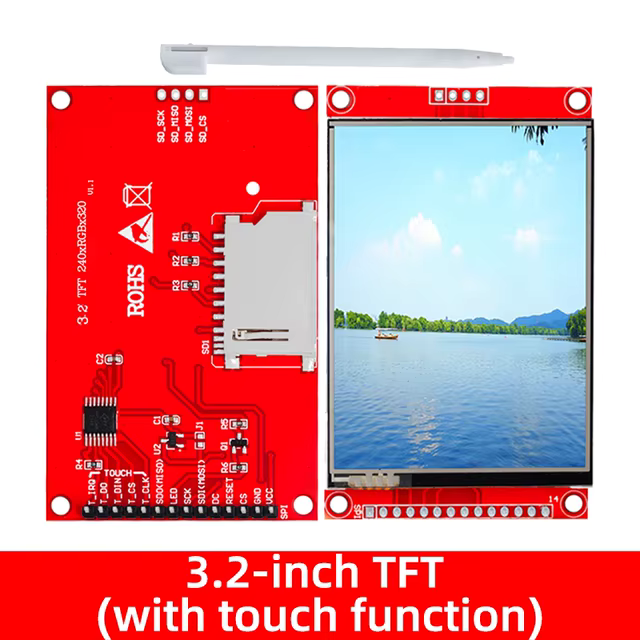 | :+1: UI freedom - any buttons, text, etc.<br/>:-1: in 2-3 times more expensive then encoder + buttons |
| Password, PIN | Fingers | Touch LCD 2.4 inch (71x52mm)<br/>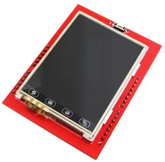 | :+1: UI freedom - any buttons, text, etc.<br/>:+1: price is similar as buttons + encoder<br/>:+1: enough small size<br/>? how hide from foreign eyes?<br/>:-1: development complexity increase significantly<br/>more simple components schema |
| PIN via typing Morse code | Pushing one button typing using Morse code | Button<br/>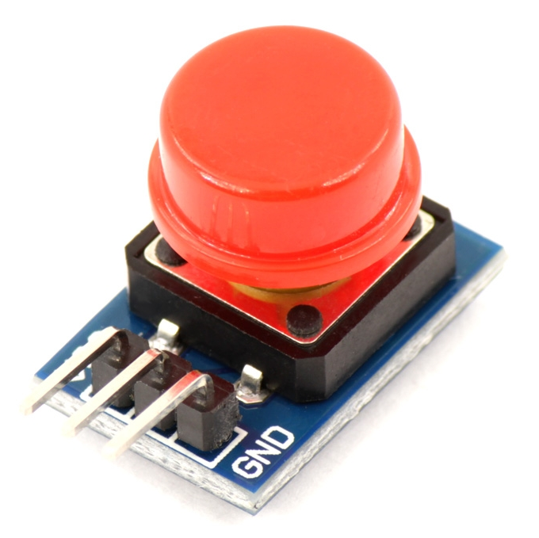 | :+1: less buttons will be needed<br/> :-1: only digits are available<br/>:-1: modern User does not know Morse code |
| Password via typing Morse code | Pushing one button typing using Morse code | Button<br/> | :+1: less buttons will be needed<br/> :-1: only digits and alpha are available<br/>:-1: modern User does not know Morse code |
| PIN via listen Morse code | Pushing one button | Button, Vibration motor<br/><br/>:heavy_plus_sign:<br/>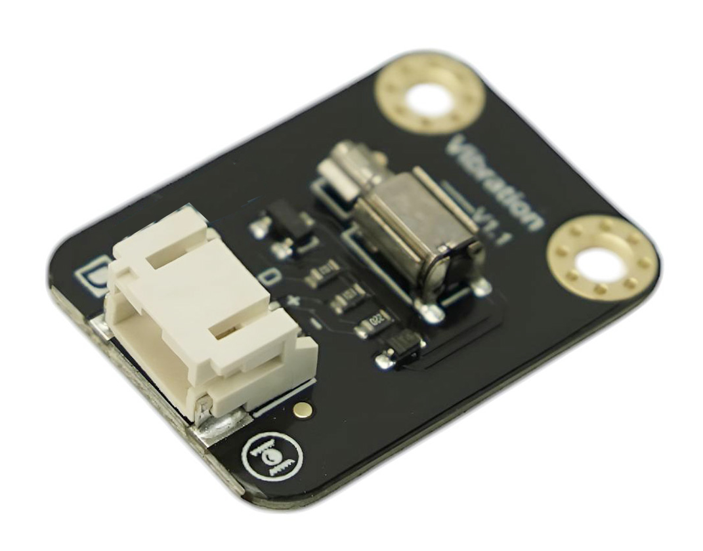 | CredsHolder vibrate digits 0-9 (in random order), User push button on choosen, CredsHolder switch to next digit in PIN<br/>:-1: only digits are available<br/>:-1: less buttons are needed<br/>:+1: you may not show the password on display, so Intruder will not recognize code just watching authentication procedure |
| ISO14443 Card | Card | NFC reader<br/>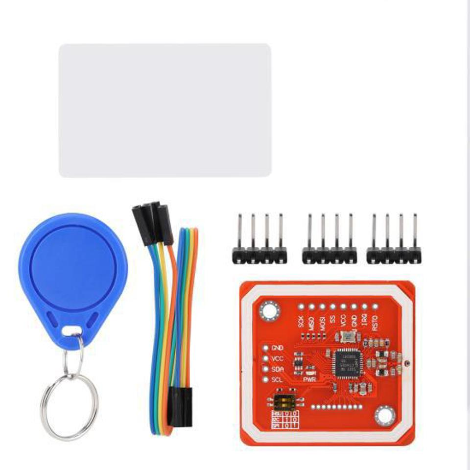 | :-1: may be stolen together with CredsHolder. Can be used as 2FA. |
| OTP | Separate OTP device/application | PIN board<br/> | :+1: only digits are needed<br/>:-1: how generate KEK if passwords is one time use?<br/>:-1: separate device/app is needed |
| Biometric. Voice | Voice | Microphone<br/>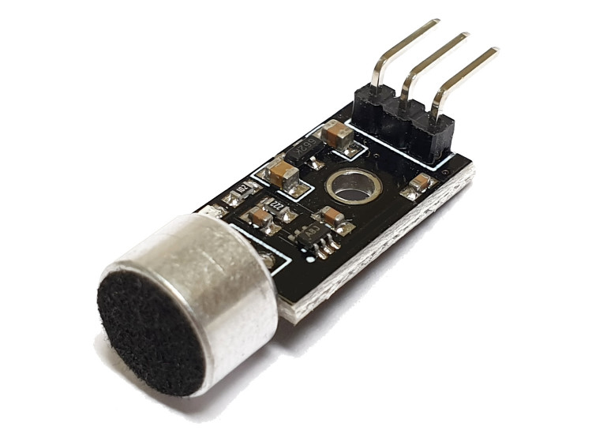 | :-1: Need voice recognition AI and consequent requirements for Controller |
| Biometric. Fingerprint | Finger | Fingerprint scanner<br/>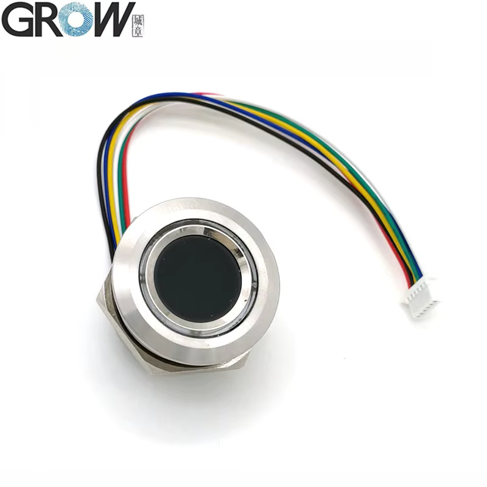 | :-1: difficult to say how difficult to trick cheap scanner<br/>:-1: high price |
| Biometric. Eye | Eye | Eye scanner | :-1: if eye is compromise then only 2nd one is available |
| Biometric. Palm vein pattern | Arm | Palm vein scanner | :-1: expensive<br/>:-1: size |

Table above contains mix of authentication artifact - knowledge or artifact - and method of processing authentication procedure.

We must take into account not only usability of CredsHolder interface but also outside conditions - Intruders spying on User. Therefore we may assume that all sequence of manipulations, pushes, clicks made by User during authentication is known by Intruder, e.g. he used video camera to record that.

Let's try prevent recognizing the PIN/Password by Intruder following next:
* Type PIN/Password not in sequential way - 1st symbol/digit, 2nd one, 3rd one, - but in random sequence, e.g. 8th symbol/digit, 3rd one, 1st one, 6th one, etc. CredsHolder will require User to do that
* Hide screen to not allow record it - allow User only to watch the screen. It may be done at least by hiding screen deeply in case and additionally using anti spy tempered glass:

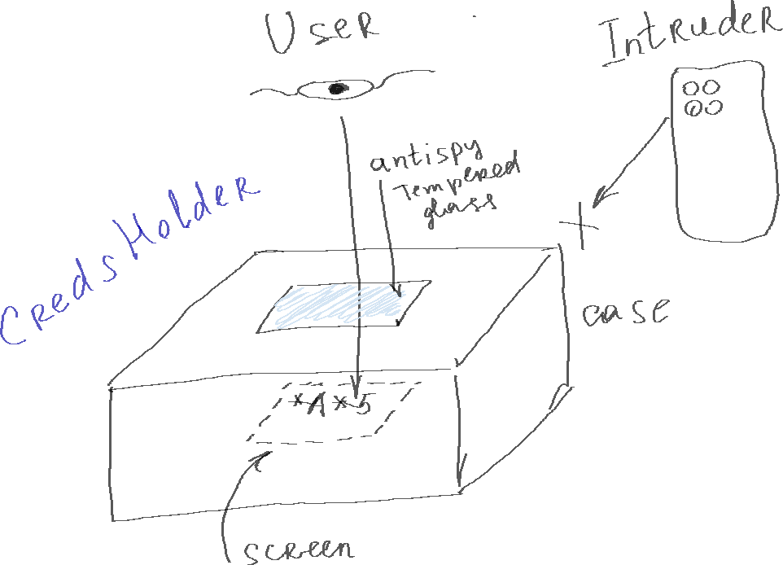

In such circumstances the Intruder will have to guess first N symbols of PIN/password. Let's calculate a chance to guess them:
* Intruder knows the used symbols because recorded typing process
* Intruder does not know sequence of that symbols
* So there are N! possible combinations ...
* ... and only 10 fail tries before CredsHolder full-block/erasing/etc.
* Therefore chance is 10/(N!), e.g. for N=6: `10/(N!) = 10/(1*2*3*4*5*6) = 0.01389 = 1.389%`
* Sound good for us by my opinion

Example of Authentication procedure screens:
```
+-----------------+
| Enter password: |
|                 |
| ..A..           |
+-----------------+
       ||
       \/
+-----------------+
| Enter password: |
|                 |
| B.*..           |
+-----------------+
       ||
       \/
+-----------------+
| Enter password: |
|                 |
| *.*.5           |
+-----------------+
       ||
       \/
+-----------------+
| Enter password: |
|                 |
| *l*.*           |
+-----------------+
       ||
       \/
+-----------------+
| Enter password: |
|                 |
| ***n*           |
+-----------------+
       ||
       \/
+-----------------+
| Enter password: |
|                 |
| *****A          |
+-----------------+
```

If try to compare options from table above then next ones looks more preferable:
* (good for MVP) rotary encoder + 4 buttons + 1.28 OLED display
* (good for next gen) 2.4 inch touch LCD
