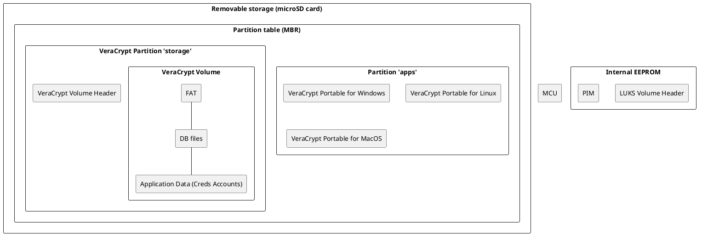

# CredsHolder Storage

## Introduction

This document is related to full chain and all places of securely storage settings and application data by CredsHolder.

## Abbreviations and Terms

* EEPROM - 
* FW - firmware
* FAT16 - 
* FIDO2 - 
* WebAuthn - 
* MEK - Media Encryption Key
* KEK - Key Encryption Key
* PIM - Personal Iteration Multiplier
* KDF - Key Derivative Function
* MCU - Microcontroller Unit (CPU + EEPROM + RAM + peripherals = MCU)

## Requirements

If shortly a lot of requirements below says next:
* CredsHolder MUST store information interested for me (credential accounts, OTP, etc.)
* If CredsHolder is broken then I may take another CredsHolder and continue use my account on it
* If I lost CredsHolder then nobody access my data
* I'm able to make CredsHolder backup

| No | User Story |
| --- | --- |
| S-2 | As an User I'd like to use hardware credential manager CredsHolder to store personal accounts only. |
| S-3 | As an User I'd like to use CredsHolder with any of devices: desktop PC, laptop, smartphone, tablet. |
| S-5 | As an User I'd like to store about 1000 accounts on CredsHolder. |
| S-6 | As an User I'd like that CredsHolder has less vulnerabilities as possible. |
| S-9 | As an User I'd like be able easy replace CredsHolder with full credentials migration to new CredsHolder if the current one is broken or User bought more modern CredsHolder model. |
| S-10 | As an User I'd like be sure that my credentials will be not compromised if CredsHolder is stolen by Intruder. |
| S-12 | As a Corporate Employee I'd like to use CredsHolder to store work accounts credentials. CredsHolder MUST all Corporate security standards. |
| S-15 | As a Governmental Employee I'd like to use CredsHolder to store work accounts credentials. CredsHolder MUST follow the related governmental security standards and laws in spite of backdoor in cipher and hashing algorithms added by Government. |
| S-16 | As a Developer I'd like that CredsHolder become widely usable all over the world. |
| S-17 | As a User I'd like to avoid vendor lock because Vendor may bankrupt or increase tariffs or block support for owner country and so on. |
| S-18 | As a User I'd like to change authentication key (master password, etc.) if it was vulnerable. |
| S-20 (optional) | As a User I'd like to allow inherit my CredsHolder by my inheritors after my death. |
| S-21 | As a User I'd like to able make CredsHolder backup. |

| No | Re User Story | Requirement |
| --- | --- | --- |
| R-3 | S-2 | CredsHolder MUST store Account Credentials. |
| R-4 | S-2 | CredsHolder SHOULD store OTP Credentials. |
| R-10 | S-5 | CredsHolder MUST support navigation between Account Credentials.<br/>It may be done like listing them one by one.<br/>It may be done like groups hierarchy<br/>It may be done like full text search.<br/>It may be done like priority queue with accounts where last used ones are located in the queue head. |
| R-11 | S-5 | CredsHolder MUST have enough Persistent Storage for 1000 Account Credentials. |
| R-12 | S-5 | CredsHolder MUST allow easy way to manage Accounts (add/delete/change). |
| R-18 | S-6, S-17 | CredsHolder MUST store Accounts Credentials inside and do that without using separate application or Cloud storage. |
| R-19 | S-6 | CredsHolder MUST keep into account that "power cut" may happen at any time. |
| R-23 | S-10 | Application Data must be encrypted and independent on data at CredsHolder internal data |
| R-24 | S-10 | CredsHolder MUST authenticate User before grand access to application data. |
| R-25 | S-10 | If User assumes that CredsHolder cannot be stolen then it should be able to turn authentication off. So ownership of CredsHolder will mean passed authentication. |
| R-27 | S-10 | CredsHolder SHOULD have some schema to erase/block/hide credentials from Intruder if both CredsHolder and User will be stolen. |
| R-30 | S-15 | CredsHolder code/FW MUST allow to extend encryption/hash algorithm and add something else. |
| R-31 | S-16 | CredsHolder SHOULD print owner contact (:question: and name :question:).<br/>If owner lost device and someone find it, device itself will help to return it back to owner |
| R-34 | S-16 | CredsHolder License MUST allow commercial usage to allow any company make and sale CredsHolder based product. |
| R-39 | S-18 | CredsHolder MUST allow to change "master password" (or it's analog). |
| R-40 | S-21 | CredsHolder MUST allow backup/restore application data/settings. |
| R-41 (optional) | S-19 (optional) | CredsHolder MUST allow password authentication. Maybe like alternative method. |
| R-42 (optional) | S-20 (optional) | CredsHolder MUST support several passwords for authentication. Or another several "master password" analogs, e.g. fingerprint, to allow notary to unblock CredsHolder.<br/>Even more better if both fingerprints/passwords - of inheritor AND notary are needed to unblock CredsHolder |

## Background

### What to store?

Let's find out what information store another similar projects:

| Project | Storage, File System | Data on board |
| :---: | :---: | :---: |
| [DIY USB password generator](https://codeandlife.com/2012/03/03/diy-usb-password-generator/) | Internal EEPROM, no FS, no encryption | Single password |
| [DYI HW Single Password Manager](https://habr.com/p/827616/) | Internal EEPROM, encryption | Single password |
| [Pastilda](https://www.crowdsupply.com/third-pin/pastilda) | microSD Card, FAT16, encryption | Encrypted KeePass 2.x database (.kdbx file) and the KeePass 2.x portable app as needed. |
| [Crypto Kakadu](https://vk.ru/cryptokakadu) | Unknown |
| [PasswordPump](https://github.com/seawarrior181/PasswordPump) | external EEPROM chip 25LC256, no FS, encryption | Credential accounts double-linked list in raw format on EEPROM |
| [PasswordPumpII](https://www.5volts.org/post/passwordpump-v2-0) | external EEPROM chip 25LC512, no FS, encryption  | Credential accounts, groups |
| [Mooltipass](https://www.themooltipass.com/) | SmartCard with key, microSD Card, no FS but [custom flash layout](https://github.com/mooltipass/minible/wiki/Mooltipass-Database-Model#-user-profile-and-db-flash-layout), encryption | Passwords, FIDO2, WebAuthn & Passkeys, Files & Notes<br/>graphic elements, FW upgrades<br/>[Own DB format](https://github.com/mooltipass/minible/wiki/Mooltipass-Database-Model):<br/>* Multiple doubly linked list-based credential and file storage<br/>* Parent (services) - Child (credentials) structure<br/>* Credential categories support<br/>* Credential favorites support<br/>* Webauthn custom credential type<br/> At the time of writing, the Mini BLE can handle logins & passwords up to 64 unicode characters long. |
| [Trezor Wallet with Secure Element](https://trezor.io/) | Secure Element | Crypto currency private key(s) |
| [Trezor Wallet without Secure Element](https://trezor.io/) | internal flash, no FS, own layout ([Trezor Wallet Storage Implementation](https://github.com/trezor/trezor-firmware/blob/main/docs/core/embed-arch/embed-arch.md#4-memory-and-isolation-model)), encryption | Crypto currency private key(s) |
| [Ledger Crypto Wallet](https://www.ledger.com/) | Secure Element | Crypto currency private key(s) |
| [Mew](https://github.com/konachan700/Mew) | | Passwords, Crypto Wallet |
| RecZone Password Safe | external EEPROM chip, NO encryption - see [Hardware Access To EEPROM chip on RecZone Password Safe](https://github.com/jackquavis/Recovering-Reczone-Password-Safe-Passwords) | Passwords |

### What to backup?

Because Ledger and Trezor wallets use hierarchical deterministic key generation they do not store information which must be backup or migrated to new device in digital view, the physical BIP39/SLIP39 backup will be enough to start use new device and restore access to your coins in blockchain:
* From [Ledger Crypto Wallet "The Master Seed" documentation](https://developers.ledger.com/docs/device-app/explanation/psd/masterseed):
```
 Ledger achieves both of these goals by using hierarchical deterministic key generation. Hierarchical deterministic key generation is used by applications to derive a theoretically infinite number of cryptographic secrets from a single master seed. This way, your cryptocurrency private keys, passwords, and other cryptographic secrets can all be determined and intrinsically “stored” in a single master seed. Thanks of this, the device’s apps don’t have to store their own private keys, because they can all be generated on-demand by the device from the master seed. This means that if your device is lost, destroyed, or reset then all you need is your master seed to recover your secrets. In addition, an application that supports this scheme can be deleted and reinstalled without losing any secure data or assets. Your master seed is randomly generated for you when you first set up your Ledger device, and then you just need to write it down to allow you to recover your device in the future.
```
* Trezor Crypt Wallet [follow the same BIP39 and SLIP39 standards](https://trezor.io/guides/backups-recovery/general-standards/how-to-use-a-wallet-backup) for backup:

```
Your wallet backup may also be referred to as a: backup, Single-share Backup, Multi-share Backup, recovery seed, seed, seed phrase, BIP39 phrase, SLIP39 phrase, mnemonic, recovery phrase (plus various combinations of these terms).
It is an ordered list of English words that contains all information necessary for recovering your wallet (i.e., accessing Bitcoin or other cryptocurrency funds on-chain).
A wallet backup provides full access to the associated wallet. This is why you must keep it safe.
```

## Proposals



* CredsHolder has removable storage (on microSD card)
* Removable storage contains 2 partitions:
  * 1st partition (label "apps") containing portable VeraCrypt applications for Linux, Windows and macOS
  * 2nd partition (label "storage") is used as encrypted storage. It's minimal size MUST be 128 MB.
* 1st partition may be absent. It's up to User how and were store them.
* 2nd partition is formatted as VeraCrypt volume
* On first start CredsHolder:
  * Generate "Recovery Code" (alpha-digit password (MEK) + PIM) 
  * Ask PIN from User
  * Create VeraCrypt on 2nd partition. Header is included.
  * Use PBKDF2 as KDF
  * Create KEK from PIN, PIM and MEK
  * Create LUKS header in internal memory and store KEK and PIM inside
* Backup procedure is cloning CredsHolder microSD card. So backup will be in encrypted form only.
* Restore procedure:
  * insert backup microSD card or card from another device
  * type "Recovery Code"
  * set new PIN
* Make brute-force attack more complex:
  * Use slowest hash function - Whirlpool at current moment
  * Use non standard PIM to make it an additional variable for brute-force attack
  * Use function to derive key which work constant time. That will not allow to guess amount of PIM

See all details how conclusion above has been designed in next sections.

## Contradictions

### Contradiction. Extract application data from device

* As an User I'd like be able easy replace CredsHolder with full credentials migration to new CredsHolder if the current one is broken or User bought more modern CredsHolder model ...
* But it's needed to extract all application data from Device
* And it SHOULD be done without additional equipment because User is not a geek in common

Proposal:
* Storage should be removable/pluggable.

Among similar projects there were two types of widely used removable flash:
* EEPROM chips in special SOIC8 to DIP8 programmer adapter
* microSD card

### Contradiction. Removed storage can be brute-forced

* CredsHolder storage SHOULD be removable 
* But that will allow perform password brute-force infinitely.

IFR: device storage MUST defense itself from brute-force

Possible variants: LUKS, VeraCrypt or custom flash layout

### Contradiction. What should be encrypted

* Similar projects has several variants:
  * partially encrypted data on custom flash layout (Mooltipass, Trezor, PasswordPump)
  * encrypted password manager database file on partition with FAT (Pastilda)
* Also there is a User Story S-3 "As an User I'd like to use CredsHolder with any of devices: desktop PC, laptop, smartphone, tablet."
* And also it's complex to support custom flash layout especially extent it and no one supported on desktop/mobile OS

According to [wiki](https://en.wikipedia.org/wiki/Comparison_of_disk_encryption_software) only next OpenSource and still maintained projects are widely supported on many OSes:
* VeraCrypt is supported on all next OS: Android, Windows, iOS, Linux, MacOS, FreeBSD
* EncFS all above plus OpenBSD, FreeBSD, NetBSD

But the [EndFS wiki](https://en.wikipedia.org/wiki/EncFS) says about vulnerabilities in implementation.

I know that LUKS and VeraCrypt has documented volume header.

Proposal:
* Use VeraCrypt
* Separate abstraction layer for encryption
* Applications will use file on FS inside encrypted volume
* Applications will be independent on encryption
* We'll be sure that ALL data is encrypted on removable device
* Each Application (password manager, OTP manager) will be able to use different files and be developed independently

### Contradiction. Where take PIM

* VeraCrypt volume header does not contain PIM
* But it's needed for decryption

Proposal:
* Store in internal flash
* Make PIM a part of "Recovery Code"

### Contradiction. PIN is too short 

* An unplugged storage will allow perform password brute-force infinitely
* And encryption algorithm and hash function is known from CredsHolder sources
* And enough long and complex password is needed to defense encryption on storage
* And non default PIM
* But User can remember and use daily enough short PIN which therefore is not usable as password

From [Trezor Storage when Secure Element is absent](https://github.com/trezor/trezor-firmware/tree/main/storage#design-rationale):
```
The purpose of the PBKDF2 function is to thwart brute-force attacks in case the attacker is able to circumvent the PIN entry counter mechanism but does not have full access to the contents of the flash storage of the device, e.g. fault injection attacks. For an attacker that would be able to read the flash storage and obtain the salt, the PBKDF2 with 20000 iterations and a 4- to 9-digit PIN would not pose an obstacle.
```

By the way, both VeraCrypt and LUKS encrypted header contains salt but LUKS header also contains a name of encryption algorithm and PIM also. That decrease brute-force complexity and that is one more reason no use LUKS on removable storage, 

#### Proposal. Use PIN as password

* Keep encrypted volume header on internal memory instead of removable storage
* Store PIM at internal memory
* BTW, [VeraCrypt Volume Format Specification](https://veracrypt.io/en/VeraCrypt%20Volume%20Format%20Specification.html) shows that only salt is not encrypted, others is encrypted.

Rejected because:
* :heavy_minus_sign: Backup procedure must be coded separately to allow User to initial recovering encrypted volume header on removable storage. That header will be erased automatically on next CredsHolder turning on
* :heavy_minus_sign: Anyway there will be a time when removable storage will contain encrypted partition header where enough easy PIN is used as password. That period is vulnerable.
* :heavy_minus_sign: PIM is still needed to informed to User to be able perform recover procedure

#### Proposal. "Use removable smart card and removable storage"

* Like [Mooltipass do that](https://www.themooltipass.com/) 
```
The Mooltipass devices all use a PIN-locked smartcard containing the AES-256bits key required for data decryption. Like any chip and pin card, 3 false tries will permanently disable the Mooltipass card.

...

- Device Design - What if I lose my Mooltipass device?

Your encrypted credentials can be exported to your computer. If you lose your device, you may purchase another one and restore your credentials or buy a simple inexpensive smartcard reader to extract your encryption key and decrypt your credential database.

...

- Device Design - What if I lose my smartcard?

Our device is shipped with two smartcards, so you can keep a copy somewhere safe. The Mooltipass allows the user to clone their smartcard as many times as they want, provided that the card PIN is correctly entered.
```
* :+1: PIN protection is on smart card side
* :+1: encryption key is not extractable and known to nobody
* :heavy_minus_sign: smart card and it's reader is needed inside CredsHolder, separate smart card reader is needed for User to make clone(s) of smart card installed in device
* :heavy_minus_sign: two cards are needed instead of one plus knowledge of "Recovery Code"
* :heavy_minus_sign: we are limited in policy of blocking device by smart card hardware
* :heavy_minus_sign: smart card code is proprietary with unknown amount of vulnerabilities

#### Proposal. "Use RFID card together with PIN"

:heavy_minus_sign: easy to lost
:heavy_minus_sign: will be always together with CredsHolder and will be stolen together

#### Proposal. "PIN for human and password for encryption"

* Keep header on removable storage - Intruder will know salt but not password and not PIM
* Use strong MEK - generate before create encrypted storage 1st time
* Show MEK and PIM as "Recovery Code" to User and highly recommend to remember 
* Generate KEK: Use PBKDF2 with PIN as password with separately generated separate KEK salt and KEK PIM. 
* Encrypt MEK with PBKDF2 output, result will be KEK. Store that at internal memory only.
* On regular usage when User unlocking device run PBKDF2 with PIN to get KEK and decrypt MEK to decrypt data on removable storage
* It's possible to use LUKS header format at internal storage to support several KEK and maybe reuse exist code supporting LUKS

* :+1: On device break you need ask User about "Recovery Code" (it's MEK) and recreate KEK at internal memory
* :+1: That will allow to use VeraCrypt which has no support for several password slots but supported on all OS (Windows, Linux, macOS). That will allow to decrypt removable storage on PC
* :+1: It's not needed to make backup as separate procedure which recover LUKS/VeraCrypt header on removable storage. User is able to make copy of removable device on PC at any time. It'll be save to store backups as digital copies.
* :heavy_minus_sign: on recovering access to storage it'll be needed to enter that long complex "Recovery Code"

### Contradiction. Complex "Recovery Code"

"Recovery Code" is complex to type during recovery procedure AND it's difficult to remember it

IFR:
* "Recovery Code" must itself be easy to remember
* Element X without increasing system complexity during recovery procedure on device keep "Recovery Code" easy to remember
* Recovery procedure must itself provide comfortable way to type "Recovery Code"

Proposal:
* Use only digits and lowercase alpha in MEK
* Use non standard PIM and make it part of "Recovery Code"

### Contradiction

* KEK derived from PIN is kept in internal memory 
* But if Intruder extract it then brute-force will be easy

IFR: Controller defense itself from extraction data from internal memory

Proposals:
* Use "Secure Boot"
  * nrf52840 has "nRF Secure Immutable Bootloader (NSIB)" suggested by Nordic Semiconductor SDK
  * STM32U5 and STM32WB35 has hardware capabilities for Secure Boot
* "non extractable bootloader" as a root of trust chain will prevent burn not-signed bootloader/firmware which may extract encryption 


### Contradiction

* CredsHolder storage is VeraCrypt encrypted partition
* And it cannot be mounted as-is on PC
* But there is a User Story S-3 "As an User I'd like to use CredsHolder with any of devices: desktop PC, laptop, smartphone, tablet."

IFR: CredsHolder storage itself allow to mount itself

Proposals:
* Removable storage contains 2 partitions:
  * 1st partition (label "apps") containing portable VeraCrypt applications for Linux, Windows and macOS
  * 2nd partition (label "storage") is used as encrypted storage

### Contradiction. What FS to use inside encrypted volume

* Different OS support not all file systems
* But there is a User Story S-3 "As an User I'd like to use CredsHolder with any of devices: desktop PC, laptop, smartphone, tablet."
* And exFAT and FAT32 is not tolerant for unexpected extraction flash drive
* From another side Controller code will fully control writing data to flash
* So it's unclear what FS to use

Let's try to write on flash without caching.

### Contradiction. Unexpected power cut tolerance

* VeraCrypt is caching data and do not write them directly
* When volume will be unexpectedly extracted then it will become unreadable
* Or file system inside become broken
* Or modifying file become broken

Let's try to write on flash without caching.

### Contradiction. What do KDF use?

* There is a recommendation to use Argon2 KDF instead of PBKDF2 to make brute-force more complex even with GPU use
* But Argon2 uses a LOT of memory, boards like Arduino, nrf52840 and STM32 does not have so much

Proposal:
* Continue PBKDF2 because it consumes small amount of memory
* That's a hardware limitation for us
* Maybe in future more powerful MCU will be able to use Argon2

### Contradiction. microSD of minimal size

* I'd like to use microSD card with minimal size to decrease device cost
* But current design requires partition with VeraCrypt portable applications on microSD card

At 15 Aug 2026 the portable apps for Windows, Linux and MacOS has summary size 102.4 MB ~= 100 MB.
Let's assume that applications for Android, iOS and BSD has similar size and multiply in 2 times.
And assume that size of that application may grow in new versions and multiply in 2 times again.
And assume that new operation systems may appear in future and multiple in 2 times one more time.

And as a result it's needed: 100 * 2 * 2 * 2 = 800 MB. Let's round up to 1GB for application files.

Also we need size for application data.

There is R-11 "CredsHolder MUST have enough Persistent Storage for 1000 Account Credentials."

Each account is up to 694 bytes ~= 768 bytes:

* Account Name - 64 bytes
* login - 32 bytes
* password - 32 bytes
* URL of resource - no official limit, assume 255 bytes
* email - 254 bytes
* phone number - 12-16 symbols
* previous password - 32 bytes
* used password generation policy - 1 byte
* expiration date/time - 8 bytes

1000 accounts equal 768000 = 750 kB - much less then amount of partition for VeraCrypt portable applications.

Let's assume that in future we'll support TOTP, maybe notes, files, etc. Anyway they will use a small bytes in comparison to VeraCrypt portable applications.

| No | Details |
| Option 1 "Download yourself" | We may try to assume that VeraCrypt portable applications are always available via Internet and User may download them on demand.<br/> But according to Murphy's law they will be needed at the moment of unavailable Internet access or equipment for that or permissions. |
| Option 2 "Second microSD Card" | Attach to device the 2nd microSD with needed application. It will be not plugged even, just attached to case. |
| Option 3 "Separate partition on main microSD" | Separate microSD will be more expensive then main microSD card with bigger size. Add separate partition for VeraCrypt portable applications |
| Option 4 "Let User to solve" | Let's add a requirement that partition with label "storage" must be present on microSD and has size at least 128 MB. <br/>CredsHolder will interpret it as VeraCrypt volume with own data.<br/>And CredsHolder will be tolerant to size of microSD card and other partitions present on it. |

Option 4 looks like compromise.

## Rejected Ideas

### Idea 1. BIP39/SLIP39

Crypto wallets uses BIP39/SLIP39 as backup to be able restore master seed and regenerate private keys using CKD function.

But it also means that master seed is a number which may be used as encryption password.

So we may randomly generate a'la master seed then convert it into 12 words, say them to user as backup.

We'll be able to do that at any time on unlocked CredsHolder.

:heavy_minus_sign: difficulty of showing sequence of many words to User, not sure how it'll be usable.

### Idea 2. Crypto card

Idea is a modification of [this idea](https://www.passwordcard.org/).

Create separate partition "crypto card" on microSD equal to 1024 * 32 bytes.

Fill them with random data.

Randomly choose 12 numbers from diapason [0-1024].

Use them as indexes and read 12 double-words (32 bytes) from "crypto card" partition.

That will be an encryption password.

As a backup you may inform User a 12 indexes as numbers or words from BIP39 wordlist.

If someone will try to find encryption password among "crypto card" partition then in worst case he will check all combinations for 12 parts: C(1024,12) = 1024! / (12! × 1012!) = 2 601 150 623 552 800 702 891 545 856

:heavy_minus_sign: more complex variant then BIP39
:heavy_minus_sign: how easy enter 12 numbers/words from 1024 words list on small device like CredsHolder to recover access to device?
:heavy_minus_sign: how easy show 12 numbers/words on small device like CredsHolder for User to remember as backup?

## Links

* [Brute-force LUKS volumes](https://blog.elcomsoft.ru/2020/08/rasshifrovka-diskov-luks/)
* [Brute-force VeraCrypt volumes](https://blog.elcomsoft.ru/2020/04/rasshifrovka-kriptokontejnerov-veracrypt/)
* [VeraCrypt Volume Format Specification](https://veracrypt.io/en/VeraCrypt%20Volume%20Format%20Specification.html)
