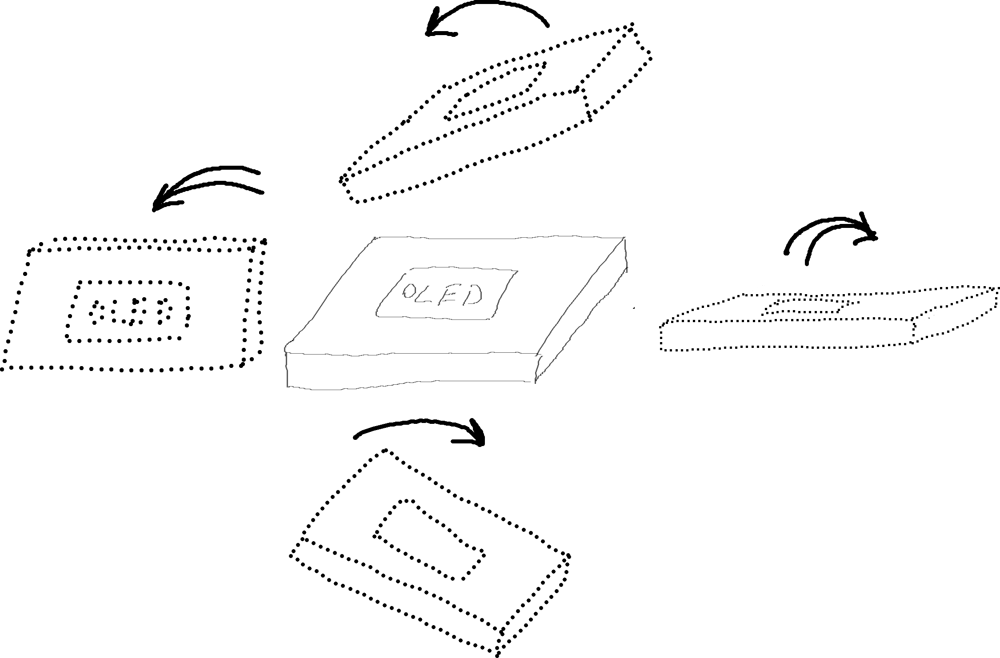
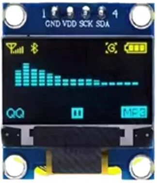
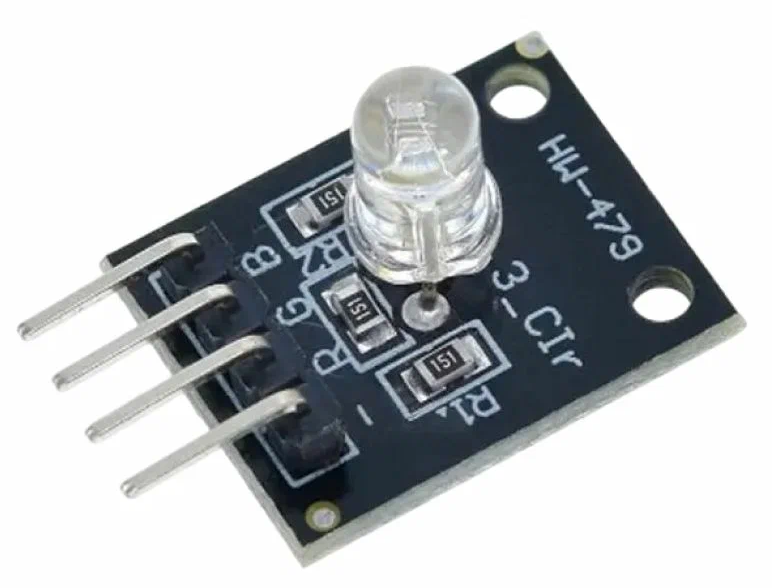

# CredsHolder UI

## Introduction

This document is related to usage input and output methods in CredsHolder.

We'll try to find answers to next questions:
* how User will manage device?
* how CredsHolder will show information to User?

## Abbreviations and Terms

* IFR - Ideal Finish Result
* Device - CredsHolder, current project main theme
* POC - Proof Of Concept

## Requirements

| No | User Story |
| --- | --- |
| S-4 | As an User I'd like that CredsHolder will fill login form/prompt itself. |
| S-5 | As an User I'd like to store about 1000 accounts on CredsHolder. |
| S-7 | As a Developer I'd like to develop new features for CredsHolder but Users will not have to buy to model to start use them. |
| S-11 | As an User I'd like be able use CredsHolder by one human arm, left or right. |
| S-16 | As a Developer I'd like that CredsHolder become widely usable all over the world. |

In scope of UI design we must list more concrete User action scenarios happen during work with CredsHolder:
* Configure PIN at first CredsHolder turn on
* Type PIN for unlock CredsHolder
* Type "Recovery Code" (password and PIM)
* Change settings (boolean, numeric, string list)
* Navigate between credential accounts
* Initiate login form filling by CredsHolder
* Lock CredsHolder

If go deeper then next input actions should be supported:
* Move Up
* Move Down
* Move Left
* Move Right
* Backspace
* Enter, Confirm, Accept
* Switch group of entering symbols
* Lock device

## Background

The question about UI was addressed in "Authentication" design.

We listed possible variants, not only used in another similar projects:

| Input method | |
| :---: | :---: |
| Rotary encoder/wheel |  |
| Group of buttons |  |
| Full keyboard |  |
| Mini keyboard |  |
| PIN keyboard |  |
| Microphone, Voice |  :heavy_plus_sign:  |
| Touch LCD |  |
| Position sensor |  |
| Microphone, knock detection | |
| Microphone, Morse code detection | |
| Piezoelectric sensor, knock detection | |
| Human mind (Sci-Fi) |  |

| Output method | |
| :---: | :---: |
| OLED 0.96 inch |  |
| Touch LCD |  |
| Speaker, Sound  | | 
| Audio card, Sound, Headset | |
| Vibration motor, Morse code |  |
| Multi color LED |  |
| Human mind (Sci-Fi) |  |

Note: "Human mind" has been added just an example that in future device maybe significantly improved after appearing new human-machine communication technologies.

## Proposals

### Entities

* Case
* Controller 
* Display
* Device Inputs (buttons, encoder, ...)
* Device sensors (accelerometer, gyroscope, microphone, reed switch, etc.)
* Device Outputs (display, speaker, vibration, LED)
* Human senses
* Human body
* Surrounding environment (atmosphere, sounds, light, pressure, humidity, etc.)
* Developer

It's need to pay into account that it's possible to use combinations of input hardware listed in previous section.

### Contradictions

What contradictions appear if one of next really available input methods will be added:

| Input method | |
| --- | --- |
| Rotary encoder/wheel | User will be able to perform two actions because push encoder is not stable and not available for wheel So it's only auxiliary input for another variant. |
| Group of buttons | User will able to perform all needed action if use single push, long push, double push, two buttons simultaneous push But that increase amount of components in schema /And buttons usage is not intuitive because it's not a keyboard I guess the most known mobile device with small amount of buttons is joystick or portable play station If make buttons similar to joystick then "quick start" will be possible. But at the same time it'll be not trivial to make device compact and sable by one arm simultaneously |
| Full keyboard |  User will be able to perform any actions But use cases is limited to home/office because nobody will take keyboard to walk |
| Mini keyboard |  User will be able to perform any actions But use cases is limited to home/office because almost nobody will buy mini keyboard and bring it together with CredsHolder |
| PIN keyboard | If add PIN keyboard then it'll easier to enter PIN for authentication But it can be recorded by outside video camera and PIN will be vulnerable And in another scenarios it's not needed such amount of buttons and it's not the most optimal schema |
| Microphone, voice | User will be able to perform any actions But communication maybe slower And voice recognition may not work for you (just remember Barry Kripke from "Big Bang Theory") And requirements for Controller will be higher because of AI voice recognition usage |
| Touch LCD |  User will be able to perform any actions And you will have a freedom to write any GUI interface, buttons and etc. And schema will be enough compact And anti spy glass may be assumed as enough to hide screen from Intruder spying But there will be higher requirements for minimal RAM and CPU, Arduino is not good enough and similar MCU, for NRF52840 you will always have a risk to reach RAM limit And  |
| Position sensor (accelerometer + gyroscope) |  User will able to perform actions: 1. Tilt Backward (= Move Down) 2. Tilt Forward (= Move Up) 3. Tilt Left (= Move Left) 4. Tilt Right (= Move Right) 5. Turn upside down (= Lock) 6. Knock (= Enter/Accept) 7. Shake horizontally (= "Switch") 8. Shake vertically (= ???) And device will be more compact And it'll be usable by one hand :+1: And it'll be cheap :+1: And requirements for Controller will be lower But device will have to use cable (or wireless interface) to connect to User equipment because if plugged to USB port directly then movements of device are not available And development complexity is unknown And usability in non ideal conditions is unknown And calibration is needed from time to time |
| Microphone, knock detection | User will able to perform one action ("Enter/Accept" or "Backspace") And can help to stably detect knocking But not all required action will be available so it's also only auxiliary input for another variant |
| Microphone, Morse code detection |  User will be able to enter numeric and alpha symbols But not perform another required actions And only minimal percent of people knows Morse code |
| Position sensor or/and Piezoelectric sensor, knock detection |  Only one action will be available for User And more stable knock detection will be done But more actions MUST be available |

What contradictions appear if one of next really available output methods will be added:

| Output method | |
| --- | --- |
| OLED 0.96 inch |  Small and compact but enough for such project as proved by PasswordPump |
| Touch LCD |  User will receive all needed information But you have risks and limitations with RAM size |
| Speaker, Sound  |  User may receive all information And device usage will be available for people with bad vision But communication will be significantly slow then via display |
| Audio card, Sound, Headset | the same contradiction as for previous item |
| Vibration motor, Morse code | User will be able to accept suggested digits during authentication But it's enough paranoid process which will be not accepted by everybody |
| Multi color LED, show CredsHolder state (locked/unlocked, in authentication, etc.) | User will be able to receive auxiliary signals But as a result LED maybe used only together with another outputs |
| Multi color LED, suggested PIN digits during authentication using Morse code | If User will recognize PIN digits for input watching LED blinking then it may be watched by Intruder too |

Let's think what combinations of inputs and outputs will give the best results with minimum hardware schema influence.

Maybe besides Position sensor together with vibration motor because the first one may detect vibration of second one as a knocking. (I think it maybe solved by using them in different time slots).

According to information above there are three more or less optimal UI:
1. Output is 0.96inch OLED and vibration motor. Input is device movements detected by position sensor (accelerometer + gyroscope)
2. Touch LCD is as both input and output
3. Output is 0.96inch OLED and encoder + group of buttons as input

POC is needed to prove Option 1. Let's try to find out how stably detect:
* 1. Tilt Backward (= Move Down)
* 2. Tilt Forward (= Move Up)
* 3. Tilt Left (= Move Left)
* 4. Tilt Right (= Move Right)
* 5. Turn upside down (= Lock)
* 6. Knock (= Enter/Accept)
* 7. Shake horizontally (= "Switch")
* 8. Shake vertically
* 9. Knocking device case
